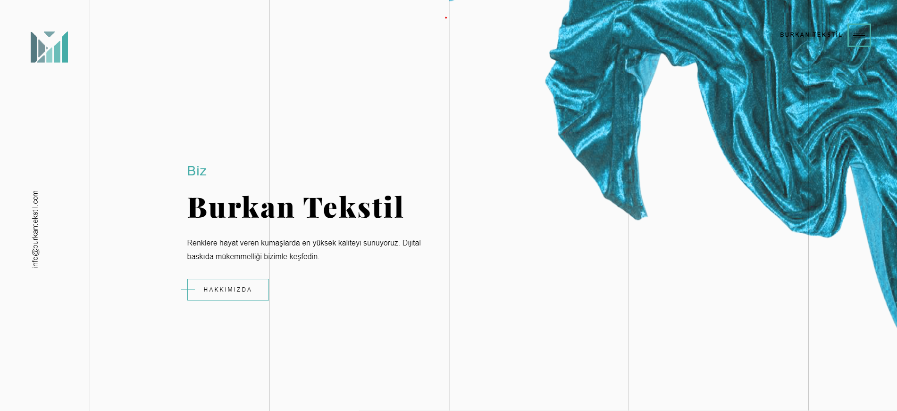
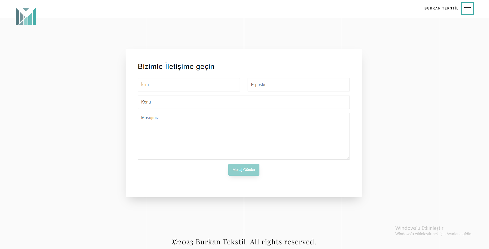

# Burkan Tekstil

Bu proje, HTML ve CSS kullanarak oluşturduğum [Burkan Teksil ](https://www.burkantekstil.com/) isimli bir websitesidir.

## Website Hakkında

Bu website, tekstil ürünlerine uygulanabilecek farklı desenleri vitrin şeklinde sunar. Kullanıcılar, önceden yüklenmiş desenleri inceleyebilir, detaylarına bakabilir ve sevdikleri desenleri not alabilir. Sadece iletişim bölümünde bulunan mail alma özelliği, kullanıcıların ilgi duydukları desenler hakkında bilgi almak için kullanılabilir. 

## Canlı Website

Websitemi canlı olarak görmek için aşağıdaki bağlantıyı kullanabilirsiniz:
[Website Linki](https://www.burkantekstil.com/)

## Özellikler

- Önceden yüklenmiş tekstil desenlerini vitrin şeklinde sunma.
- Her desen için ayrıntılı sayfa gösterimi.
- Kullanıcıların istedikleri desenleri not alabilmesi.
- İletişim kısmında mail alma özelliği.

## Ekran Görüntüsü

## Teknolojiler ve Kütüphaneler

Bu website HTML, CSS, JavaScript, Bootstrap ve PHP ile oluşturulmuştur.

1. Projeyi klonlayın:

git clone https://github.com/kullanici_adi/teksil-dijital-baski.git

2. Klonlanan klasöre gidin:

cd teksil-dijital-baski

3. Klasörde yer alan `index.html` dosyasını herhangi bir modern web tarayıcısıyla açın.

## İletişim

Herhangi bir soru veya öneriniz için bana e-posta gönderebilirsiniz: enesagalar@gmail.com

---
Geliştirici: Enes AĞALAR